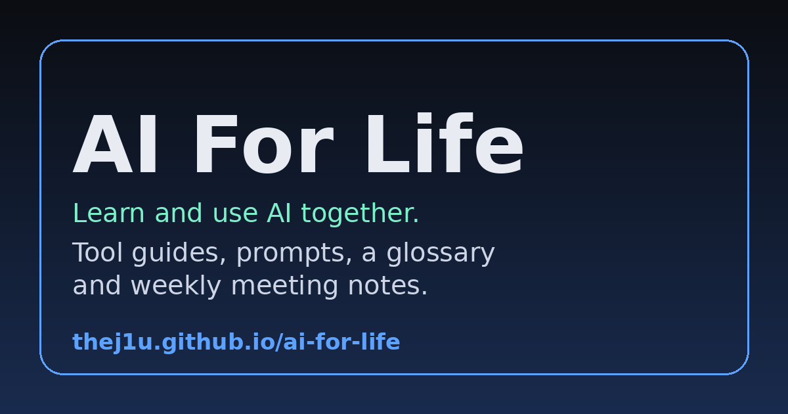

# AI For Life

**Open the website: https://thej1u.github.io/ai-for-life/** (no account or install needed).

A student-run club guide to practical AI: tool walkthroughs with business use cases, a searchable glossary, prompts, a meeting log, and a place for everyone to contribute. Built for people who are new to AI, code, or both. We meet every Thursday, 4:00 to 5:00 PM Mountain, at BYU.

## What is inside

- **Tool guides with full walkthroughs:** FLUX 3, Higgsfield, CapCut, Google AI Edge Eloquent, Hugging Face, GitHub, Muse, and building your own model.
- **Scheduled news watch:** make AI check the news for you.
- **AI by industry:** IT/IS, analysis, marketing, finance, accounting, construction, insurance and more.
- **Safe AI checklist, cost calculator, roadmap board.**
- **Glossary of 150+ terms,** from API to UX to backend and frontend.
- **Contributors page:** a verifiable way to put your contribution on a resume.

## Contribute in 5 minutes

1. Open any file on GitHub and click the pencil icon.
2. Make a small change and commit it.
3. Click **Create pull request**.

Full steps are in [CONTRIBUTING.md](CONTRIBUTING.md). Using an AI assistant? Point it at [CLAUDE.md](CLAUDE.md).

## License

Code and text: [MIT](LICENSE). The header video and some images were made or shared by club members, who keep credit for their work (see the Contributors page). See also the [Code of Conduct](CODE_OF_CONDUCT.md).

---

## Details for developers

A beginner-friendly guide to the AI tools we talk about in the **AI For Life** club, plus a glossary of the tech and business words you will hear.

**Live site:** https://thej1u.github.io/ai-for-life/ (no account or install needed, just open the link).

*Want your own copy of this site?* Fork the repo, then turn on GitHub Pages: Settings, Pages, deploy from `main`, folder `/ (root)`. GitHub Pages is a free switch that turns the repo's files into a website, and it will appear at `https://YOUR-USERNAME.github.io/ai-for-life/` (replace YOUR-USERNAME with your GitHub username).

## What is inside

| Page | What it covers |
| --- | --- |
| `index.html` | Home page with the header video and all tools |
| `tools/flux-3.html` | FLUX 3 by Black Forest Labs (AI video with sound) |
| `tools/higgsfield.html` | Higgsfield (multi-model AI video studio) |
| `tools/google-ai-edge-eloquent.html` | Google AI Edge Eloquent (free dictation app) |
| `tools/hugging-face.html` | Hugging Face (open model hub) |
| `tools/github.html` | GitHub (store, share and publish projects) |
| `tools/muse.html` | Muse (Meta's personal AI agent) |
| `automate.html` | Scheduled news watch (automation) |
| `start.html` | Start here: what the club is, how to join in, FAQ |
| `meetings.html` | Weekly meeting time, calendar invite and meeting log |
| `prompts.html` | Copy-and-paste prompt library |
| `showcase.html` | Member projects |
| `safe-ai.html` | Checklist for using AI safely at work and school |
| `calculator.html` | AI video cost calculator |
| `board.html` | Club roadmap board |
| `contributors.html` | Contribution log and resume guide |
| `404.html`, `sitemap.xml`, `robots.txt` | Missing-page screen and search-engine files |
| `templates/tool-template.html` | Copy this to write a new tool guide |
| `tools/capcut.html` | CapCut (video editing) |
| `tools/build-your-own-model.html` | A path to fine-tuning and publishing your own model |
| `glossary.html` | Searchable notes: API, CLI, MCP, CEO, CIO, CCO and more |
| `roadmap.html` | Beginner learning path |

## Header video

The home page plays `assets/header.mp4` (a FLUX 3 clip shared in the club chat). Optional: add `assets/header-poster.jpg` as the still image shown while it loads. If the video is missing, the page falls back to a gradient.

## Edit it yourself (no build step)

This is plain HTML, CSS and a little JavaScript. Open any `.html` file in a text editor and change the words. To preview, open `index.html` in your browser.

- Add a new tool: copy a file in `tools/`, edit the text, and add a card in `index.html`.
- Add a glossary term: copy an `<article class="term">` block in `glossary.html`.

## Contributing

Open an issue or pull request with a better prompt, a fix, or a new tool. Keep claims factual and link official sources.

## Notes

Tools and prices change quickly. Confirm details on each official site. Do not commit API keys or private data.

## Extras built in

- **Search:** the box in the header searches every tool page, the glossary terms and the other pages. It reads `search-index.json`.
- **Share and install:** `share.html` has a QR code, a Share button, and steps to add the site to a phone home screen. The site is also an installable web app (`manifest.webmanifest`, `sw.js`).

## Regenerating the QR code and search index

The QR code points to `https://thej1u.github.io/ai-for-life/`. If you move to a custom domain, make a new QR code for the new address and replace `assets/qr.png` and `assets/qr.svg`. Whenever you add or edit pages, the search index (`search-index.json`) needs to be rebuilt too.

## Contributing

Everyone in the club is welcome to add to this site. See [CONTRIBUTING.md](CONTRIBUTING.md) for the step-by-step guide, or open an issue with an idea. If you use Claude Code or another AI assistant, it will read [CLAUDE.md](CLAUDE.md) and guide you through adding things.
